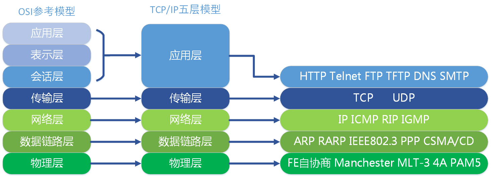
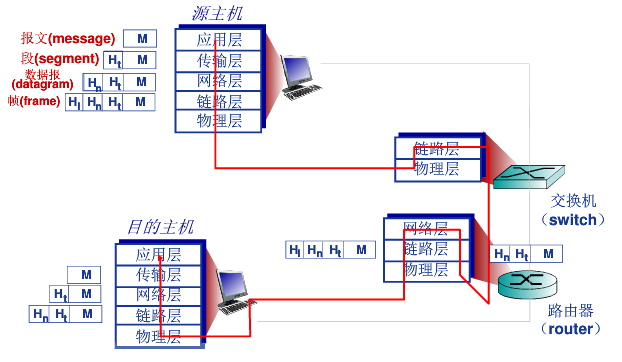

# 协议层次及其服务模型

因特网是一个极为复杂的系统，该系统里存在着大量的应用程序和协议、各种类型的端系统、分组交换机和各种类型的链路级媒体。但是它同时也是有着清晰结构的，就像我们前面在网络核心 一节介绍的，我们仍能构建它的结构模型。

## 分层体系结构

为了给网络的设计提供一个结构，网络设计者以分层的方式组织协议以实现这些协议的网络硬件和软件。

### 协议分层

#### 1. 应用层

应用层是网络应用程序及它们的应用协议存留的地方。英特网的应用层包括许多协议，例如：FTP、SMTP和FTP。我们把应用层的信息分组称为报文。

#### 2. 运输层

英特网的运输层在应用程序端点之间传送应用层报文。在英特网中，有两种运输协议，即TCP和UDP，利用其中任意一个都能运输应用层报文。我们将运输层的信息分组称为报文段。

#### 3. 网络层

因特网的网络层负责将称之为数据报的网络层分组从一台主机移动到另一台主机。在一台源主机中的因特网运输协议向网络层递交运输场报文段和目的地址。

#### 4. 链路层

因特网的网络常通过源和目的地址之间的一系列路由器路由数据报，为了将分组从一个节点移动到路径上的下一个节点，网络层必须依靠该链路层服务。我们把链路层信息分组称之为帧。

#### 5. 物理层

虽然链路层的任务是将整个帧从一个网络元素移动到邻近的网络元素。然而物理层的任务是将该帧的一个个比特从一个节点移动到下一个节点，在这层中的协议仍然是链路相关的，并且进一步与该链路的实际传输媒体有关。

### OSI模型

在因特网协议栈出现以前，OSI模型是ISO组织研发的计算机网络结构模型。OSI的模型一共有7层，从下到上依次为：物理层，链路层，网络层，传输层，会话层，表示层，应用层。相比因特网体系结构，OSI多了两层。因特网将两层的功能留给了开发者自行实现。

## 封装

封装就是应用程序数据在发送之前到物理网络之前，将沿着协议栈从上往下一次传递，每层都将在上层数据的基础之上加上自己的头部信息（有事还包括尾部信息），以实现改成功能的过程就是封装。

