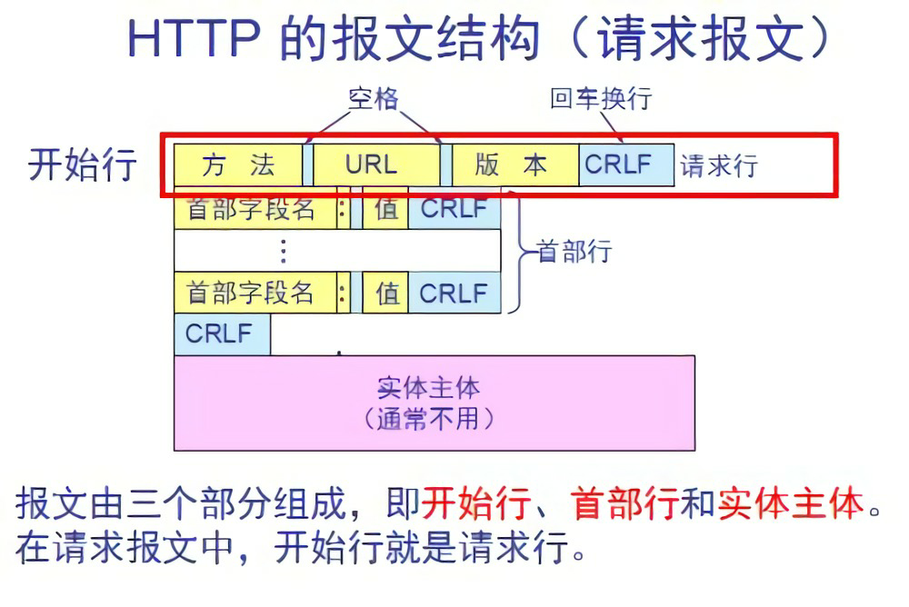
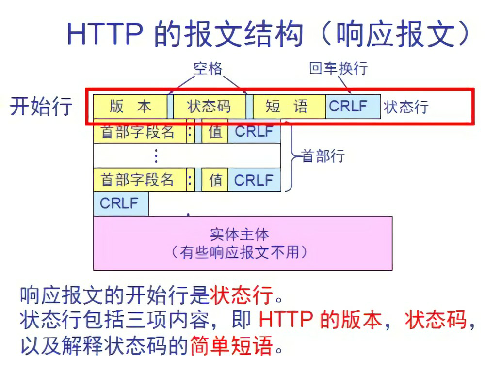
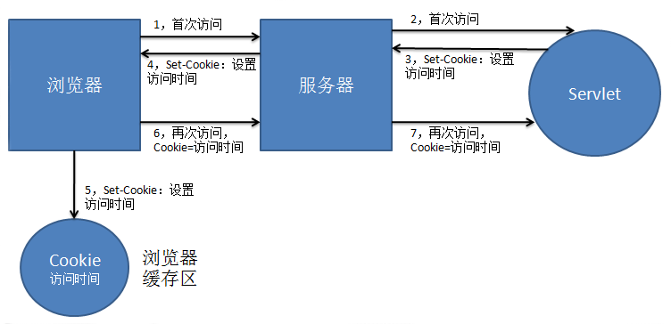
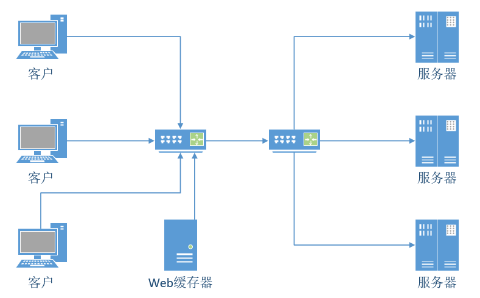

# Web和HTTP

## HTTP概况

Web的应用层协议是超文本传输协议（HTTP）。客户程序和服务器程序运行在不同的端系统中，通过交换HTTP报文进行会话。
HTTP定义了Web客户向Web服务器请求Web页面的方式，以及服务器向客户传送Web页面的方式。
HTTP使用TCP作为它的支撑运输协议，端口80.
HTTP服务器不保存关于客户的任何信息，所以我们说HTTP是一个无状态协议。

## 非持续连接和持续连接

HTTP默认使用持续连接。

### 持续连接

每个请求/响应对是经一个单独的TCP连接发送。

### 非持续连接

所有的请求/响应对经相同的TCP连接发送。

### 采用非持续连接的HTTP

相同的客户-服务器之间，为每一个请求/响应建立一个TCP连接，耗费时间。

### 采用持续连接的HTTP

相同的客户-服务器之间，所有的请求/响应通过一个TCP连接，一条连接超过一定时间未被使用，则断开连接。

## HTTP报文格式

### 请求报文

第一行是请求行，后继的行是首部行。

``` HTTP
GET /somedir/page.html HTTP/1.1
Host: www.someschool.edu
Connection: close
User-agent: Mozilla/5.0
Accept-language:fr

```

#### 请求行

请求行有三个字段，方法字段，URL字段，HTTP版本字段。

    GET /somedir/page.html HTTP/1.1
    调用GET方法，请求/somedir/page.html对象，HTTP版本为1.1

#### 首部行

首部行有两个字段，首部字段，首部值字段。

    Host: www.someschool.edu
    主机名为www.someschool.edu

    Connection: close
    发送该请求对象后，关闭该连接

    User-agent: Mozilla/5.0
    浏览器的类型为Mozilla/5.0

    Accept-language:fr
    获得该对象的法语版本

#### 方法

- GET  请求返回一个对象

- POST  向服务器提供一条数据

- HEAD  请求一个不带对象的返回

- PUT  向服务器上传对象

- DELETE  在服务器上删除对象

#### 请求报文通用格式



### 响应报文

第一行是状态行，后续是首部行，之后是实体体

``` HTTP
HTTP/1.1 200 OK
Connection: close
Date: Tue, 18 Aug 2015 15:44:04 GMT
Server: Apache/2.2.3 (CentOS)
Last-Modified: Tue, 18 Aug 2015 15:11:03 GMT
Content-Length: 6821
Content-Type: text/html
(data data data)

```

#### 状态行

状态行有三个字段，协议版本字段，状态码，状态信息。

    HTTP/1.1 200 OK
    HTTP协议版本为1.1，状态码为200，状态信息为OK

#### 首部行

首部行有两个字段，首部字段，首部值字段。

    Connection: close
    告诉客户，发送完该请求数据后关闭该连接

    Date: Tue, 18 Aug 2015 15:44:04 GMT
    产生并发送该响应报文的时间和日期

    Server: Apache/2.2.3 (CentOS)
    表示该报文时运行在CentOS系统中的Apache Web服务器产生的

    Last-Modified: Tue, 18 Aug 2015 15:11:03 GMT
    表示改文件最后一次修改的时间

    Content-Length: 6821
    被发送对象中的字节数

    Content-Type: text/html
    表示该实体体中的对象是HTML文本

#### 实时体

实体体是报文的主要部分，即它包含了所有请求对象本身。

    (data data data)
    请求对象

#### 状态码 状态信息

- 200 OK  请求成功，信息在返回的响应报文中
- 301 Moved Permanently  请求对象已经被永久转移了，新的URL定义在响应报文的Location首部行中
- 400 Bad Request  一个通用的差错代码，指示该请求不能被服务器理解
- 404 Not Found  被请求的文档不在服务器上
- 505 HTTP Version Not Supported  服务器不支持请求报文使用的HTTP协议版本

#### 响应报文通用格式



## 用户于服务器的交互：cookie

HTTP协议是无状态的，Web站点通过cookie技术来识别和记录用户。
第一次访问服务器时，服务器会生成cookie识别码。通过响应报文中的Set-cookie首部将该用户的cookie识别码发给浏览器，浏览器将其记录下来。之后每次访问该服务时，都会向服务器发送cookie识别码，以识别该用户，记录该用户在服务器上的访问历史记录。



## Web缓存

Web缓存器也叫代理服务器，它是能够代表初始Web服务器来满足HTTP请求的网络实体。Web缓冲器有自己的磁盘储存空间，并在储存空间中保存最近请求过的对象的副本。当客户请求数据时，优先从Web缓存器中请求可以有效降低时延。



### Web缓存器工作流程

1. 客户请求向Web缓存器请求
2. 若Web缓存器拥有客户请求，则直接将响应数据给客户；若Web缓存器没有，则向服务器请求
3. 然后将服务器的响应数据保存Web缓存器中一份，然后Web缓存器将数据响应给客户

## 条件GET方法

Web缓存器可以有效减少响应时间，但缓存器中的数据有可能时陈旧的，条件GET方法保证缓存器中的数据是最新的。
若GET的请求方法中包含一个If-modified-since的首部行，则该报文就是一个条件GET请求报文。

### 条件请求报文

``` HTTP
GET /fruit/kiwi.git HTTP/1.1
Host: www.exotiquecuisine.com
If-modified-since: Wed, 9 Sep 2015 09:23:24

```

#### 首部行

    If-modified-since: Wed, 9 Sep 2015 09:23:24
    告诉服务器，仅当文件在此时间之后修改过才发送对象

### 响应报文

``` HTTP
HTTP/1.1 304 Not Modified
Date: Sat, 10 Oct 2015 15:39:29
Server: Apache/1.3.0 (UNIX)
(empty entity body)

```

#### 状态行

    HTTP/1.1 304 Not Modified
    标志该文件在这个时间后并没有被修改过

#### 实体体

    (empty entity body)
    由于没有被修改过故不发送对象实体体
