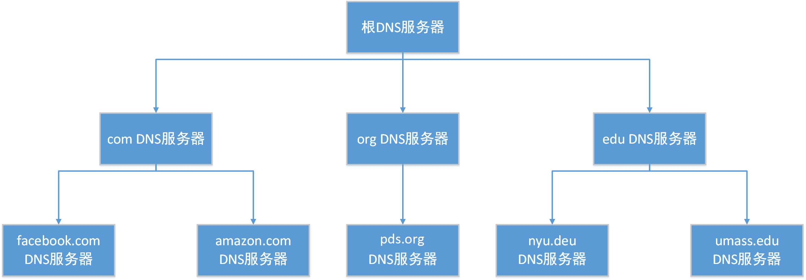
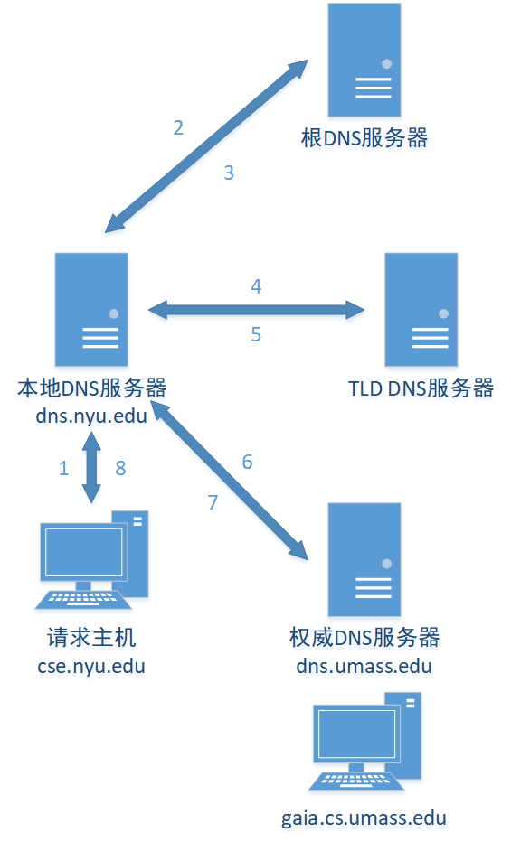
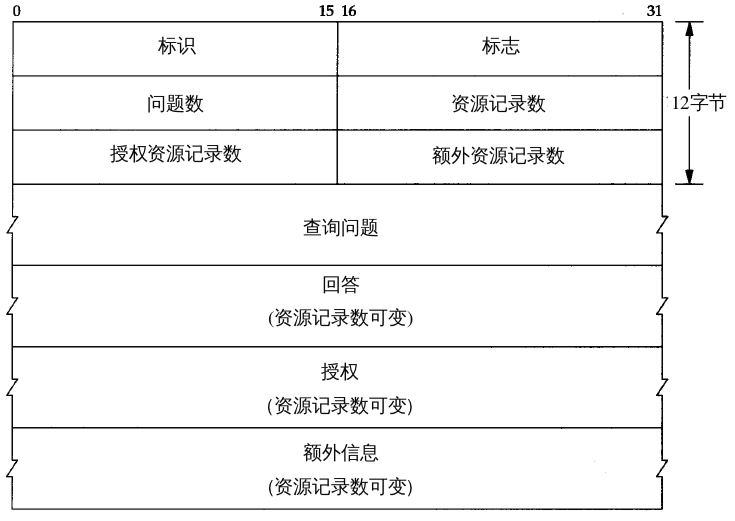

# DNS：英特网的目录服务

英特网上的主机可以用多种方式进行标识，`hostname`和`IP`。

hostname|IP
:-:|:-:
www.baidu.com|36.152.44.95
www.google.com|36.152.44.95

## DNS提供的服务

DNS可以将hostname解析为对应的IP地址，是一个分层的DNS服务器实现的分布式数据库。DNS协议运行在UDP上，端口53。

### DNS运行流程

1. 同一台用户主机上运行着DNS应用的客户端
2. 浏览器从URL中抽取主机名，并将主机名发送给DNS应用的客户端
3. DNS客户向DNS服务器发送一个包含主机名的请求
4. DNS最终会收到一份回答报文，其中含有对应于该主机名的IP地址
5. 一旦浏览器接收到来自DNS的该IP地址，它能够向位于该IP地址80端口的HTTP服务器进程发起一个TCP连接

### DNS重要服务

#### 主机别名

一台主机拥有一个规范主机名，还可以拥有多个别名。应用程序可以调用DNS来获得主机别名对应的规范主机名和IP地址。

#### 邮件服务器别名

电子邮件应用程序可以调用DNS，对提供的主机名别名进行解析，以获得该主机的规范主机名及其IP地址。同一公司的邮件服务器和Web服务器可以使用相同的主机别名。

#### 负载均衡

在冗余服务器群中，一个规范主机名对应一个IP地址集合。当客户请求报文时，DNS会向规范主机名对应的IP地址集合循环分配负载。

## DNS工作机理概述

### DNS集中式设计的缺陷

#### 单点故障

若该DNS服务器崩溃，整个英特网随之瘫痪

#### 通信容量

单个DNS服务器不得不处理所有DNS查询，访问量过高。

#### 近距离集中式数据库

单个DNS服务器不可能近邻所有查询客户。

#### 维护

单个DNS服务器不得不为所有的英特网主机保留记录。这使得这个中央数据库庞大，而且他还不得不为解决每个新添加的主机而平凡更新。

### 分布式层次数据库

为了处理拓展性问题，DNS使用了大量的DNS服务器，它们以层次方式组织，并且分布在全世界范围内。大致来说，有3种类型的DNS服务器：`根DNS服务器`、`顶级域DNS服务器`和`权威DNS服务器`。



#### 根DNS服务器

根DNS服务器提供顶级域DNS服务器的IP地址。

#### 顶级域DNS服务器

对于每个顶级域（如com、org、net、edu和gov）和所有国家的顶级域服务器（如uk、fr、ca和jp），都有顶级域DNS服务器。顶级域DNS服务器提供了权威DNS服务器的IP地址。

#### 权威DNS服务器

在英特网上具有公共可访问主机的每个组织机构必须提供公共可访问的DNS记录，这些记录将这些主机的名字映射为IP地址。一个组织对的权威DNS服务器收藏了这些DNS记录。

#### 本地DNS服务器

本地DNS服务器不属于该服务器层次结构，但它对DNS层次结构式至关重要的。每个ISP都有一个本地DNS服务器，本地DNS服务器通常近邻用户，用户可以简单的确定本地DNS服务器的IP地址。用户的请求被发往本地DNS服务器，本地DNS服务器将起着代理的作用，并将该请求转发到DNS服务器层次结构中。



1. 请求主机向本地DNS服务器进行请求查询主机名对应的IP地址
2. 本地DNS服务器将报文转发到根DNS服务器
3. 根DNS服务器回复顶级域DNS服务器IP地址
4. 本地DNS服务器向顶级域DNS服务器发送查询报文
5. 顶级域DNS服务器返回权威DNS服务器的IP地址
6. 本地DNS服务器向权威DNS服务器发送查询报文
7. 权威DNS服务器向本地DNS服务器返回主机名对应的IP地址
8. 本地DNS服务器将主机名对应的IP地址返回给请求主机

上图用到了递归查询和迭代查询。从请求主机到本地DNS服务器是递归查询，后续都是迭代查询。从理论上来讲任何DNS查询即可以是递归查询也可以是迭代查询。下图为递归查询。


### DNS缓存

为了改善时延性能并减少在因特网上到处传输的DNS报文数量，DNS广泛的使用了DNS缓存技术。当请求主机发送一个请求时，获得了一个主机名和其对应IP地址，本地DNS服务器会将其记录下来，下次请求该主机名的IP时就可以直接从本地DNS服务器上获取。本地DNS缓存并不是永远有效，隔一段时间后将丢弃缓存信息。

## DNS记录和报文

每个DNS回答报文种包含了一条或多条资源记录（RR），资源记录是一个包含4个字段的元组`(Name, Value, Type, TTL)`，其中TTL决定了从DNS缓存中删除的时间。

#### 若Type = A

Name是主机名，Value是该主机名对应的IP地址。

#### 若Type = NS

Name是一个域，Value是该域的顶级域DNS服务器的IP地址

#### 若Type = CNAME

Name是主机的主机名，Value是主机对应的规范主机名。

#### 若Type = MX

Name是邮件服务器的别名，Value是邮件服务器的规范主机名。

### DNS报文

DNS有两种报文，查询和回答报文，且报文的格式相同。



#### 首部区域

表示符是一个16比特的数，用于标示该查询，同时也会复制到回答报文中，客户用来匹配查询和回答。
标志字段有16比特有若干含义。1比特的查询/回答标志位中，0表示查询报文，1表示回答报文。当请求的是权威服务器时，回答报文中将设置1比特的权威标志位。若客户在该DNS服务器没有找到记录时希望递归查询，将设置一比特的希望递归标志位。若该DNS服务器支持递归查询时，它的回答报文中会设置一比特递归可用标志位。
在该首部中还有4个数量字段，这些指出首部之后，四类数据区域出现的数量。

#### 问题区域

问题区域包含正在进行查询的信息，该区域包括名字字段（查询的主机名）、类型字段（询问的问题类型）。

#### 回答区域

回答区域包含了对最初请求的名字的资源记录。在回答报文中可以有多个资源记录，因此一个主机名能够有多个IP地址。

#### 权威区域

权威区域包含了其他权威服务器的记录。

#### 附加信息区域

附加信息区域包含了其他有帮助信息。

### 在DNS数据库中插入记录

当注册一个主机和IP时，注册机构需要确保将一个类型NS和一个类型A的记录输入com的顶级域DNS服务器中。
注册主机名为dns1.networkotupia.com，IP为212.212.212.1的Web服务器，需要将下面两资源记录插入到该DNS系统中。

``` RR
(networkotupia.com, dns1.networkoutput.com, NS)
(dns1.networkutopia.com, 212.212.212.1, A)
```
