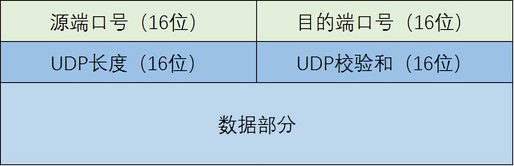

# 无连接运输：UDP

TCP的拥塞控制会导致如因特网电、视频会议之类的实时应用性能变差。由于这些原因，多媒体应用开发人员通常将这些应用运行在UDP之上。
由于UDP没有拥塞控制机制，由无控制的UDP发送方引入的高丢包率将引起TCP发送方大大地减小它们的速率。

### 关于发送内容及发送时间的控制更为精细

对数据传输时延要求较高且可以忍受一些数据丢失的应用更适合使用UDP。

### 无需建立连接

TCP需要经过三次握手才能开始进行数据传输，而UDP无需任何准备即可开机进行数据传输。

### 无连接状态

UDP不维护连接状态，也不跟踪这些参数。因此，UDP应用程序一般能支持更多用户。

### 分组首部开销小

每一个TCP报文段都有20字节的头部开销，而每一个UDP报文段仅有8个字节的头部开销。

## UDP报文段



## UDP校验和

UDP检验和提供了差错检测功能。这就是说，检验和用于确定当UDP报文段从源到达目的地移动时，其中的比特是否发生了变化。发送方的UDP对象对报文段中的所有16比特字的和进行反码运算，求和是遇到的任何溢出都被回卷。在发送进行校验和计算后，到了接受方对每组16位进行相加计算，包括校验和，若此值为1111 1111 1111 111则正确传输，否则则有差错。

### 计算方法

将接收到的UDP报文段，分割成16比特一块，不足补充0，校验和清零，全部进行相加，若有超过16位的进位则回卷到地位进行相加，相加完毕后进行取反即可得到校验和。如下所示：

```
# 假设报文段如下
1000 1000 1000 1000
1110 1110 1110 1110
1010 1010 1010 1010
1001 1001 1001 1001


1000 1000 1000 1000
+
1110 1110 1110 1110
=
1 0111 0111 0111 0110   # 存在第17位进位则加入尾部
=>
0111 0111 0111 0111     # 第一轮完毕


0111 0111 0111 0111 
+
1010 1010 1010 1010
=
1 0010 0010 0010 0001
=>
0010 0010 0010 0010     # 第二轮计算完毕


0010 0010 0010 0010
+
1001 1001 1001 1001
=
1011 1011 1011 1011     # 第三轮计算完毕


# 最后进行取反
1011 1011 1011 1011
=>
0100 0100 0100 0100     # 得到校验和
```

### 端到端原则

提出校验和的目的是不能保证源和目的之间的所有链路都提供差错校验。此外，即使报文经链路正确的传输，当报文段储存在某台路由器的内存中，也可能引入比特差错。在既无法确保熟练度的可靠性又无法确保内存中差错检测的情况下，如果端到端数据传输服务，要提供差错检测UDP就必须在端到端的基础上，在运输层提供差错检测，这是在设计系统中被称颂的`端到端原则`的例子，该原则表述为：因为某种功能，必须基于端到端实现，与在较高级别提供这些功能的代价相比，在较低级别上设置的功能可能是容与或者几乎没有价值的。
