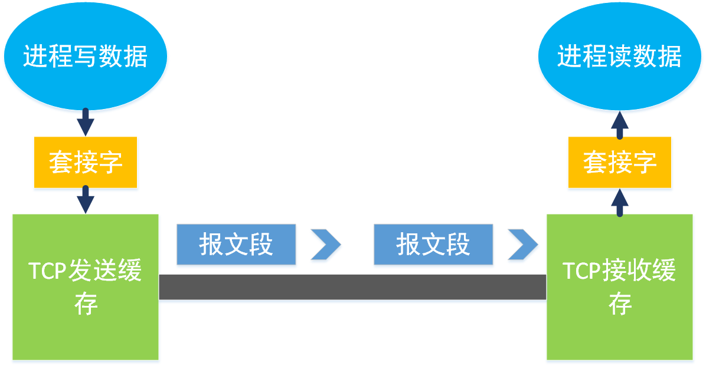
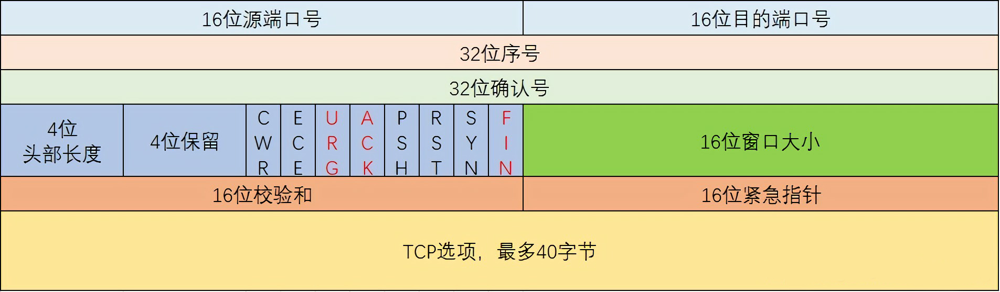
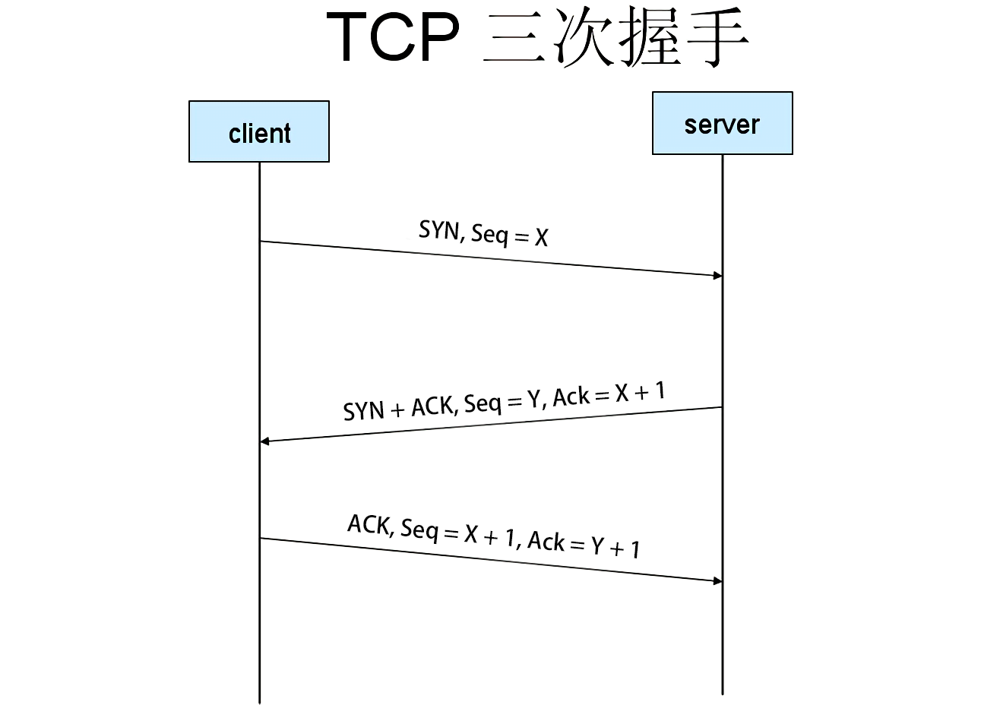
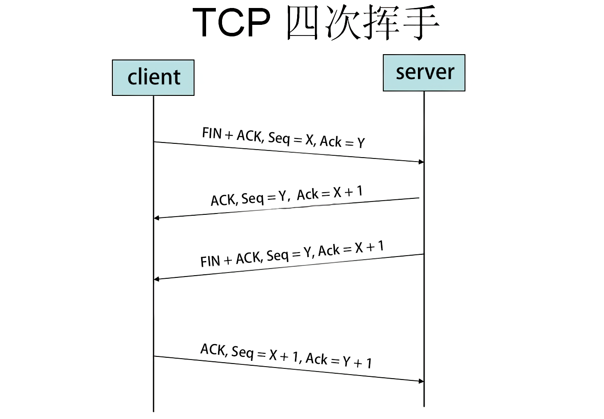
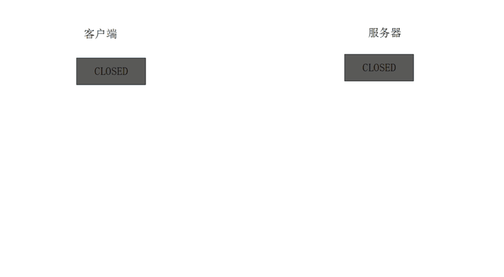
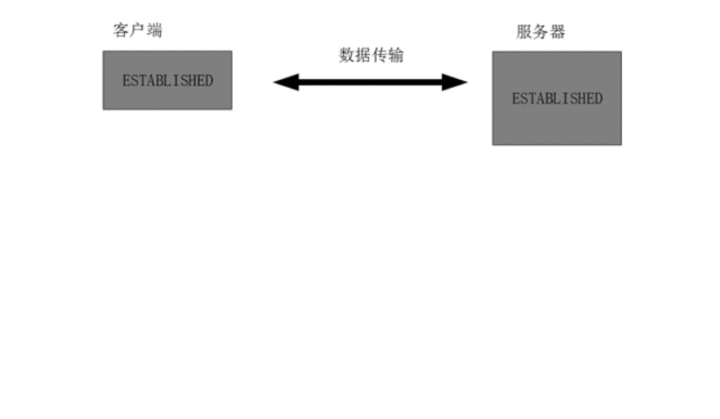
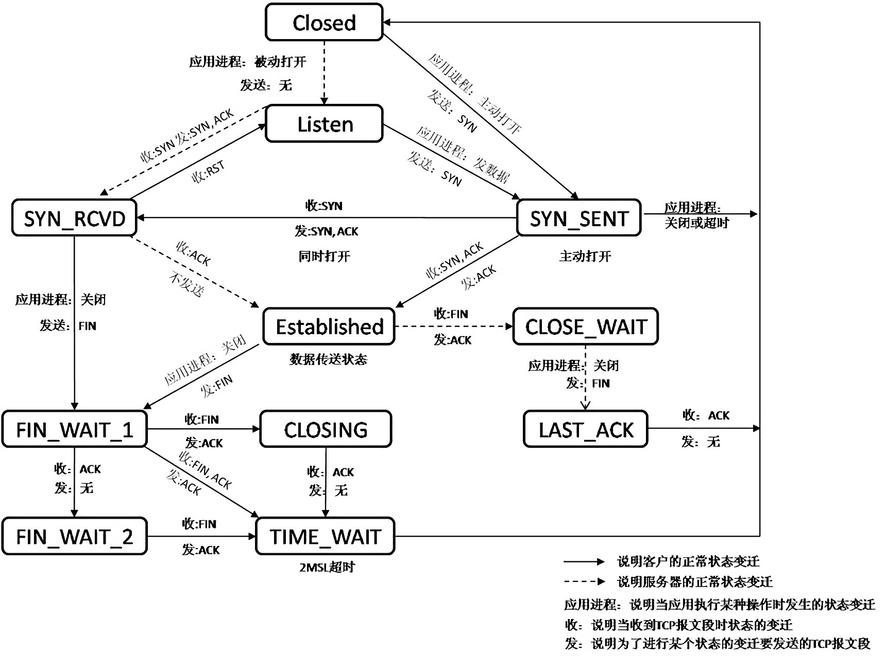

# 面向连接的运输：TCP

## TCP连接

TCP连接被称为是`面向连接`的，两个应用程序进行通信之前必须先相互握手。即它们必须相互发送某些预备报文段，以建立确保数据传输的参数。
TCP连接提供的是`全双工服务`，如果一台主机上的进程A与另一台主机上的进程B存在一条TCP连接，那么应用层数据就可以从进程B流向进程A的同时，也从进程A流向进程B。
TCP连接是`点对点`的，即在单次发送操作中，一个发送方只能发给一个接收方。

### 三次握手

1. 客户首先发送一个特殊的TCP报文段
2. 服务器用另一个特殊的TCP报文段来响应
3. 最后客户端再用第三个特殊报文段作为响应

前两个报文不包含应用层数据，第三个报文可以包含应用层数据。

### 最大报文长度

`最大报文长度（MSS）`取决于本地发送主机发送的最大链路层帧长度，即所谓的`最大传输单元（MTU）`来设置。设置该最大报文长度要保证一个TCP报文段加上TCP/IP首部长度将适合单个链路层帧。

### TCP报文段

TCP为每块客户数据配上一个TCP首部，从而形成多个TCP报文段，这些报文段被下传给网络层，网络层将其分别封装在网络层IP数据报中。然后这些IP数据报被发送到网络中。

### TCP缓存

TCP的连接包括：一台主机上的缓存、变量和与进程连接的套接字，以及另一台主机上的缓存、变量和与进程连接的套接字。
当一端发送一个报文段时，先被放入发送缓存中，然后由下层发送；当另一端收到一个报文短时，也会先存入接收缓存中，然后传递给上层。



## TCP报文段结构

TCP报文段由首部字段和一个数据字段组成。

### 首部字段

- 源端口号和目的端口号，用于多路复用/分解来自或送到上层应用的数据
- 序号和确认号，这些字段被TCP发送方和接收方用来实现可靠数据传输服务
- 接收窗口，这个字段用于流量控制，表示接收方愿意接收的字节数量
- 首部长度，该字段指示了以32位的字为单位的TCP首部长度
- 选项，用于发送方与接收方协商最大报文段长度时，或在告诉网络环境中用作窗口调节因子时使用
- 标志字段，ACK标志指示确认字段中的值是有效的；URG表示紧急数据；RST、SYN和FIN用于连接建立与拆除；CWR和ECE用于拥塞通告；PSH指示接收方应立即将数据交给上层
- 紧急数据指针，指向要紧急上传的数据的地址



### 序列号与确认号

一个报文段的序号是该报文段的首字节的字节流编号。如发送5000字节的数据，每此发送1000字节，第一段报文段序号为0，第二段为1000，第三段为2000，以此类推。首次序列号通常是随机产生的，下个序列号为上次序列号加上此次发送数据长度。
发送方填充报文段的确认号是发送方希望从接收方收到的下一个字节的序号。
若中途有失序的报文段，通常接收方保留失序的字节，并等待缺少的字节以填补该间隔。

## 往返时间的估计与超时

### 估计往返时间

连接返回时间为RTT。大多数的TCP实现仅在某个时刻做一次SampleRTT检测，而不是为每一个报文段做一次SampleRTT检测，从而产生一个新的值。TCP
绝不为已被重传的报文段计算SampleRTT检测，它仅为传输一次的报文段做RTT检测。
TCP维持了一个SampleRTT均值（EstimatedRTT），一旦获取到下一个SampleRTT时，就会根据下列公式更新EstimatedRTT：

```
EstimatedRTT = (1 - α) * EstimatedRTT + α * SampleRTT
α : 通常取0.125
```

除了估算RTT，测量RTT的变化也是有价值的。定义RTT的偏差为DevRTT，用于计算SampleRTT与EstimatedRTT的偏移程度，如下公式：

```
DevRTT = (1 - β) * DevRTT + β * fabs(SampleRTT - EstimatedRTT)
β : 通常取0.25
```

### 设置和管理重传超时间隔

超时时间间隔为TimeoutInterval，计算公式如下：

```
TimeoutInterval = EstimatedRTT + 4 * DevRTT
```

## 可靠数据传输

### 一些有趣的情况

#### 当发送方向接收方发送一个报文段

当发送方发送一个报文段，接收方回复的ACK丢失，则在定时器超时后，再此发送相同报文段，此时接收方回复ACK，发送方收到该确认则知道该报文段已经成功发送。

```
send : seq = 92, data = 8
recv : ACK丢失
若定时器超时
    send : seq = 92, data = 8
    recv : ack = 100
```

#### 当发送方发送多个报文段时

当发送方发送多个报文段，接收方的回复的第一个ACK超时，则发送方重传第一个报文段。若收到发送方的第二个报文段的ACK，则返送方认为已经收到119字节之前的所有数据。

```
send : seq = 92, data = 8
send : seq = 100, data = 20
若报文段1的定时器超时
    send : seq = 92, data = 8
    若接收方收到发送方的ACK
    recv : ack = 120
```

### 时间间隔加倍

当发生超时时间时，超时定时器事件间隔较上一次乘以2，以此类推。

### 快速重传

当出现报文段丢失时，接收方向发送方发送最后一个接收到的的按序字节数据进行重复确认，即产生一个冗余ACK

事件|TCP接收方动作
:-|:-
所有期望序列号顺序到达，所有之前数据皆被确认|延迟的ACK。对另一个按序报文段的到达最多等500ms。如果下一个按序报文段在这个时间内没有到达，则发送一个ACK
所有期望序列号顺序到达，另一个按序报文等待ACK传输|立即发送单个累计ACK以确认连个按序的报文
比期望大的序列号到达，检测出间隔|立即发送冗余ACK，指示下一个期待的字节的序号（间隔的低端的序号）
能正好填充间隔的报文段到达|倘若该报文段起始于间隔的低端，则立即发送ACK

连续三次收到冗余ACK时，认为该报文段已完全丢失，TCP就立马重传，而无需等待定时器超时。

### 回退N步还是选择重传

TCP采用选择确认，它允许TCP接收方有选择地确认失序报文段，而不是累积地确认最后一个正确接收的有序报文段。

## 流量控制

TCP为它的应用程序提供了`流量控制服务`以消除发送方使接收方缓存溢出的可能性。流量控制因此是一个速度匹配服务，即发送方的发送速率与接收方应用程序的读取速率相匹配。
接收方会向发送发送一个标识接收方剩余缓存大小的值，即`接收窗口`，来控制发送方发送数据的大小。当接收方缓存区剩余大小为0时，发送方将发送一个字节的数据，接收方确认该字符。并开始清空缓存，将一个非0的缓存剩余大小的值发送给发送方。

## TCP连接管理

### 三次握手



#### 三次握手的原因

确保双方都已经准备好了进行连接通信。

### 四次挥手



#### 四次挥手的原因

确保双方都已经完全断开该链接，释放占用的资源。

### 连接状态

#### 三次握手状态



#### 四次挥手状态



#### 总状态


