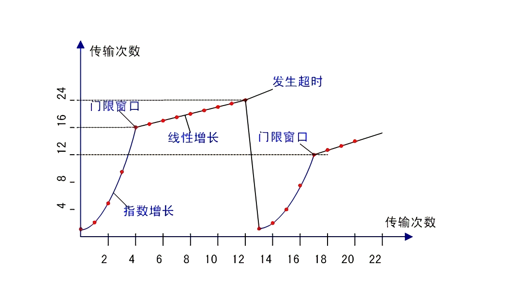

# TCP拥塞控制

一个丢失的报文段表意味着拥塞，因此当丢失报文段时应当降低TCP发送方的速率。
一个确认的报文段指示该网络正向接收方交付发送方的报文段，因此，当对先前未确认的报文段的确认到达时，能过增加发送发的速率。
带宽探测，检测该带宽的传输速率，以探测道德信号进行行动。

### 慢启动

最开始的单位事件内发送一份报文段，若成功抵达，则倍增单位时间发送报文段的数量，如1、2、4、8等。

### 拥塞避免

到达门限值时，不再将发送报文段倍增，而是每次加一，缓慢增加。

### 快速恢复

一旦出现拥塞则立马将进入拥塞避免的门限变成原来的一半，然后开始重新开始执行慢开始过程。

## 公平性

多个并行的TCP连接会对带宽的分配带来不公平的影响，具有较小的往返时延的连接将会分配到较多的带宽。
UDP没有拥塞控制算法，UDP流量很大时会压制TCP的流量。

## 网络辅助拥塞控制

在网络层，IP数据层首部的服务类型字段中的两个比特被用于`明确拥塞通告（ECN）`。路由器所使用的一种ECN比特设置指示该路由器正在历经拥塞。该拥塞指示则由被标记的IP数据包携带，送给目的主机，再由目的主机通知发送主机。
