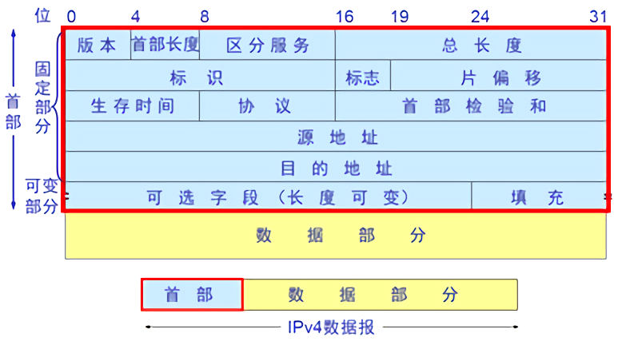
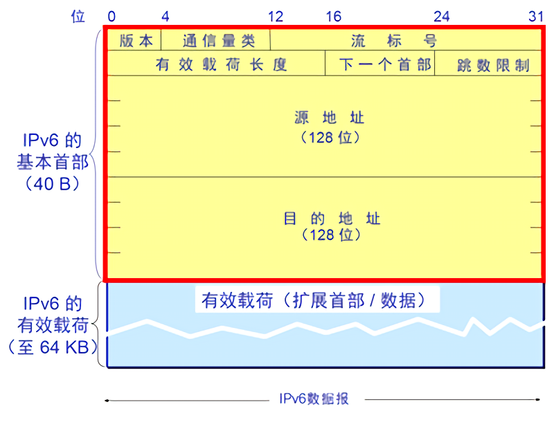

# 网际协议：IPv4、寻址、IPv6及其他

## IPv4数据报格式

### 版本号

标识IP协议的版本。

### 首部长度

确定IP数据报首部的长度。

### 服务类型

该字段用于区分不同类型的IP数据报能相互区别开来。

### 数据报长度

IP数据报的总长度，以字节计。

### 标识、标志、片偏移

将IP报文段分成多个片时使用。

### 寿命

该字段用来确保数据报不会永远在网络中循环。每当一台路由器处理数据报时，该字段的值减1。若该字段减为0，则该数据报必须丢弃。

### 协议

该字段指示了IP数据报的数据部分应该交给哪个特定的运输层协议。6代表TCP，17代表UDP

### 首部校验和

首部校验和哟关于帮助路由器检测收到的IP数据报中的比特错误。

### 源和目的IP地址

当某源生成一个数据报时，它在源IP字段中插入它的IP地址，在目的IP地址字段中插入其最终目的的地址。

### 选项

选项字段允许IP首部被扩展。首部选项意味着很少使用，因此决定对每隔数据报收部不包括选项字段中的信息。

### 数据

IP数据报中的数据字段包含要交付给目的地的运输层报文段。也可以承载其他类型的数据。

## IPv4数据报分片

当IP数据报的长度大于路由器最大传输单元时，路由器将一个IP数据报分割成多个适当大小的IP数据报。重新组装IP片的任务交给了端系统实现。并将标识、标志和片偏移放在IP数据报首部中。当生成一个数据报时，发送主机在为该数据报设置源和目的地址的同时贴上标识号。发送主机通常将它发送的每隔数据报的标识号加1。偏移字段指定了该片应该放在初始IP数据报的哪个位置上。最后一篇的标志被设为0，其他的设为1。

## IPv4编址

每个IP地址长度为32比特，总共由2^32个可能的IP地址。

### 子网

为了确定子网，分开主机和路由器的每个接口，产生的隔离的网络岛，使用接口端接这些隔离的网络的端点。这些隔离的网络中的每一个都叫做一个子网。。IP编址为这个子网分配一个地址，100.110.111.0/24，其中/计法，有时称之为子网掩码，指示32比特中的最左侧24比特定义了子网的地址。在此子网中，任何要连接到其他主机的主机其地址具有100.110.111.x的形式。

### 分类编址

a.b.c.d/24被分为A、B和C类网络。一个IP地址的网路部分正好为1、2和3字节的要求。

### 动态主机配置协议

DHCP可以为新加入该网络中的主机分配一个临时IP，每次加入该网络时，分配的IP可能都不同。

## 网络地址转换

NAT路由器它至少有一个有效的公网IP地址。这样，所有使用本地地址的主机在和外界通信时，都要在NAT路由器上将其本地地址转换成全球IP地址，才能和因特网连接。
NAT路由器内部有一个NAT转换表，并且在表项目中包含了端口号及其IP地址，可以将分组准确的分发给目地主机。

## IPv6

### IPv6数据报格式

#### 版本

标识该IP版本号

#### 流量类型

该字段用于区分不同类型的IP数据报能相互区别开来。

#### 流标签

标识一条数据报的流，能过对一条流中的某些数据报给出优先权，后者它能过用来对来自某些应用的数据报给出更高的优先权。

#### 有效载荷长度

给出了数据报中跟在定长的40字节数据报首部后面的字节数量

#### 下一个首部

该字段标识数据报中的内容需要交付给哪个协议。

#### 跳限制

该法数据报的每台路由器对该字段的内容减1。如果跳限制计数达到了0，则该数据报将被丢弃。

#### 源地址和目的地址

当某源生成一个数据报时，它在源IP字段中插入它的IP地址，在目的IP地址字段中插入其最终目的的地址。

#### 数据

IP数据报中的数据字段包含要交付给目的地的运输层报文段。
