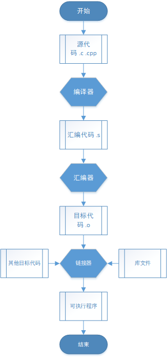

# 编译内存

---

## C++编译过程

源文件 -> 预处理 -> 编译器 -> 汇编器 -> 链接器 -> 可执行程序



---

## 内存分区

分区|作用
-|-
栈|编译器自动分配释放 ，存放函数的参数值，局部变量的值
堆|由程序员分配释放， 若程序员不释放，程序结束时可能由操作系统回收
静态|全局变量和静态变量的存储是放在一块的
文字常量|常量字符串就是放在这里
程序代码|存放函数体的二进制代码

---

## 堆和栈的区别

### 申请方式

- 栈是系统自动分配的
- 堆要主动申请

### 内存分布

- 栈在内存空间中是一块连续的空间，向低地址扩展
- 堆在内存空间中是不连续的空间，向高地址扩展

### 分配响应

- 分配栈空间，如果剩余空间大于申请空间则分配成功，否则分配失败栈溢出
- 申请堆空间，堆在内存中呈现的方式类似于链表，在链表上寻找第一个大于申请空间的节点分配给程序，将该节点从链表中删除，大多数系统中该块空间的首地址存放的是本次分配空间的大小，便于释放，将该块空间上的剩余空间再次连接在空闲链表上

### 申请效率

- 栈是有系统自动分配，申请效率高，但无法控制
- 堆是主动申请，效率低，使用起来方便但是容易产生碎片

### 存放内容

- 栈中存放的是局部变量，函数的参数
- 堆中存放的内容由程序员控制

---

## 变量

### 全局变量

具有全局作用域。全局变量只需在一个源文件中定义，就可以作用于所有的源文件。当然，其他不包含全局变量定义的源文件需要用 extern 关键字再次声明这个全局变量

### 静态全局变量

具有文件作用域。它与全局变量的区别在于如果程序包含多个文件的话，它作用于定义它的文件里，不能作用到其它文件里，即被 static 关键字修饰过的变量具有文件作用域。这样即使两个不同的源文件都定义了相同名字的静态全局变量，它们也是不同的变量

### 局部变量

具有局部作用域。它是自动对象（auto），在程序运行期间不是一直存在，而是只在函数执行期间存在，函数的一次调用执行结束后，变量被撤销，其所占用的内存也被收回

### 静态局部变量

具有局部作用域。它只被初始化一次，自从第一次被初始化直到程序运行结束都一直存在，它和全局变量的区别在于全局变量对所有的函数都是可见的，而静态局部变量只对定义自己的函数体始终可见

### 内存位置

变量|位置
-|-
全局变量|静态储存区
静态全局变量|静态储存区
局部变量|栈
静态局部变量|静态储存区

### 变量的销毁机制

销毁时会按照从后向前的顺序销毁，也就是说，越在后面定义的对象会越早销毁。其中的原因就是函数是在栈中保存的，因此，先定义的对象先压栈，所以在退栈时就会后销毁。而如果参数有多个的话，大多数编译器是从右开始压栈的，也就是参数列表最右边的变量最先压栈，所以参数列表最右边的变量会在最后销毁

### 变量创建于销毁

变量|创建|销毁
-|-|-
全局变量|主函数执行之前|程序结束之后
静态全局变量|主函数执行之前|程序结束之后
局部变量|首次运行到此处|离开作用域
静态局部变量|首次运行到此处|程序结束之后

---

## 对象

### 对象创建与销毁

对象|创建|销毁
-|-|-
全局对象|主函数执行之前|程序结束之后
静态全局对象|主函数执行之前|程序结束之后
局部对象|首次运行到此处|离开作用域
静态局部对象|首次运行到此处|程序结束之后

### 对象大小

- 遵循结构体的对齐原则
- 与普通成员变量有关，与成员函数和静态成员无关。即普通成员函数，静态成员函数，静态数据成员，静态常量数据成员均对类的大小无影响。因为静态数据成员被类的对象共享，并不属于哪个具体的对象
- 虚函数对类的大小有影响，是因为虚函数表指针的影响
- 虚继承对类的大小有影响，是因为虚基表指针带来的影响
- 空类的大小是一个特殊情况，空类的大小为 1，当用 new 来创建一个空类的对象时，为了保证不同对象的地址不同，空类也占用存储空间

---

## 内存泄漏

由于疏忽或错误导致的程序未能释放已经不再使用的内存

### 防止内存泄漏

- RAII技术，构造时申请内存，析构时释放内存
- 使用智能指针

### 检查内存泄漏工具

valgrind

---

## 智能指针

- auto_ptr：资源只可为一个指针所有，复制时会失去所有权，不可管理数组，不可存入容器
- shared_ptr：资源可以被多个指针共享，使用计数机制表明资源被几个指针共享，拷贝则计数加1，析构则计减1，减至0则释放内存，不可直接管理数组
- unique_ptr：独享所有权的智能指针，资源只能被一个指针占有，该指针不能拷贝构造和赋值，但可以移动，可以直接管理数组
- weak_ptr：指向 share_ptr 指向的对象，能够解决由shared_ptr带来的循环引用问题

---

## new delete

### new步骤

1. 调用operator new(sizeof(Object))分配内存
2. 调用Object::Object()构造函数生成类对象
3. 返回相应指针

### operator new

1. void *operator new (std::size_t size) throw (std::bad_alloc);
2. void *operator new (std::size_t size, const std::nothrow_t &nothrow_constant) throw();
3. void *operator new (std::size_t size, void *ptr) throw();

第一第二种可以重载，第三种不可重载。new Object()，调用第一种；new(std::nothrow) Object()调用第二种；new (ptr)Object()调用第三种

第一种分配size个字节的存储空间，并将对象类型进行内存对齐，失败抛出std::bad_alloc
第二种在分配失败时不抛出异常，它返回一个空指针
第三种（placement new）调用合适的构造函数在ptr所指的地方构造一个对象，之后返回实参指针ptr，ptr可以是堆也可以是栈

### delete this

1. this对象是必须是用new操作符分配（而不是用new[]，也不是用placement new，也不是局部对象，也不是global对象）
2. delete this后，不能访问该对象任何的成员变量及虚函数（delete this回收的是数据，这包括对象的数据成员以及vtable，不包括函数代码）
3. delete this后，不能再访问this指针（不能去检查它、将它和其他指针比较、和 NULL比较、打印它、转换它，以及其它的任何事情）

---

## 对象生成

### 只在堆生成

``` cpp
// 在栈上生成需要public的析构函数
class A
{
public:
    static A* create() { return new A(); }
    void destory() { delete this; }

protected:
    A() {}
    ~A() {}
};

```

### 只在栈生成

``` cpp
// 在堆上生成需要调用operator new
class A
{
public:
    A() {}
    ~A() {}

private:
    void* operator new(size_t) {}
    void operator delete(void*) {}
};
```

---
