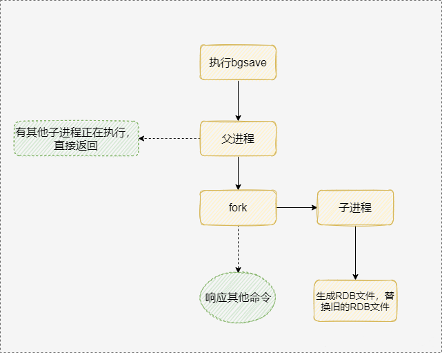
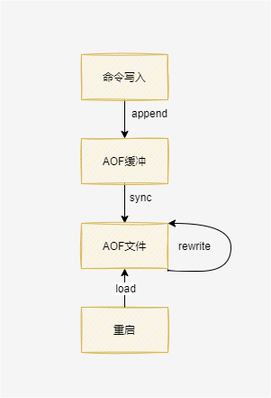

# 持久化

持久化就是把内存的数据写到磁盘中，防止服务宕机导致内存数据丢失。Redis支持两种方式的持久化，一种是RDB的方式，一种是AOF的方式。前者会根据指定的规则定时将内存中的数据存储在硬盘上，而后者在每次执行完命令后将命令记录下来。一般将两者结合使用

## RDB

RDB是Redis默认的持久化方案。RDB持久化时会将内存中的数据写入到磁盘中，在指定目录下生成一个dump.rdb文件。Redis重启会加载dump.rdb文件恢复数据

### RDB持久化过程

1. 执行BGSAVE命令
2. Redis父进程判断当前是否存在正在执行的子进程，如果存在则直接返回
3. 父进程执行fork()操作创建子进程，fork()操作过程中父进程会阻塞
4. 父进程fork()完成后，父进程继续接收并处理客户端的请求，而子进程开始将内存中的数据写入硬盘的临时文件
5. 当子进程写完所有数据后会用该临时文件替换旧的RDB文件
6. 当Redis服务重启时，重新读入RDB中的数据

### RDB触发方式

- 手动触发：执行SAVE或者BGSAVE命令
- 自动触发：配置save SECOND NUM。执行SHUTDOWN命令，若没有开启AOF持久化功能则自动执行BGSAVE

### RDB优点

- Redis加载RDB恢复数据远远快于AOF的方式
- 使用子进程进行持久化，不会阻塞主进程

### RDB缺点

- RDB方式无法做到实时持久化，RDB创建子进程，执行成本较高
- RDB文件使用特定的二进制格式保存，老版本可能会服务兼容新版本的文件

## AOF

以独立日志的方式记录每次写命令，Redis重启时会重新执行AOF文件中的命令达到恢复数据的目的。AOF的主要作用是解决了数据持久化的实时性，AOF 是Redis持久化的主流方式

### AOF持久化过程

1. 所有写入命令会追加到AOP缓冲区中
2. AOF缓冲区根据对应的策略向硬盘定期同步
3. 定期对AOF文件进行重写，达到压缩文件体积的目的
4. 当Redis服务器重启时，可以加载AOF文件进行数据回复

### AOF触发方式

- 自动触发：开启appendonly yes，向aof缓冲中写入每一条命令，定期写入文件

### AOF优点

- AOF可以更好的保护数据不丢失，最低可以配置1S同步一次
- AOF以追加模式写入，无需磁盘寻址，写入性能很高

### AOF缺点

- AOF文件比RDB数据快照大
- 数据恢复较慢

## RDB和AOF

当RDB和AOF同时开启时，会优先使用AOF恢复数据，AOF较RDB更完整

1. 若数据不敏感，且可以从其他地方重新生成，可以关闭持久化
2. 若数据叫重要，且可以承受几分钟的数据丢失，则使用RDB
3. 若是用做内存数据，要使用Redis的持久化，则开启RDB和AOF
4. 若只用AOF，考虑到可靠性和性能，则使用everysec的配置
