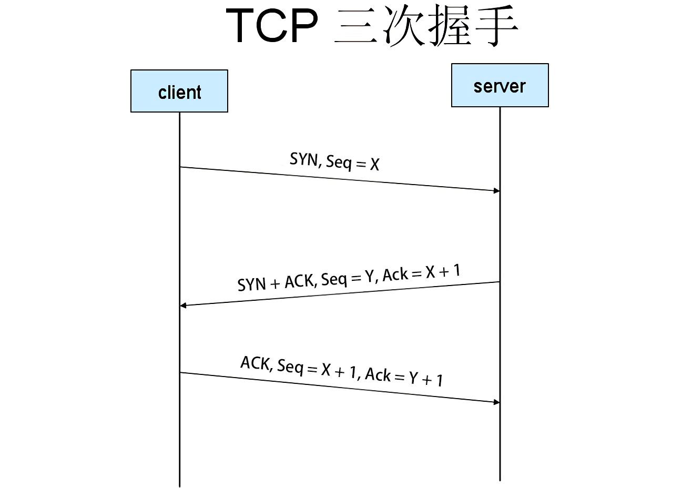
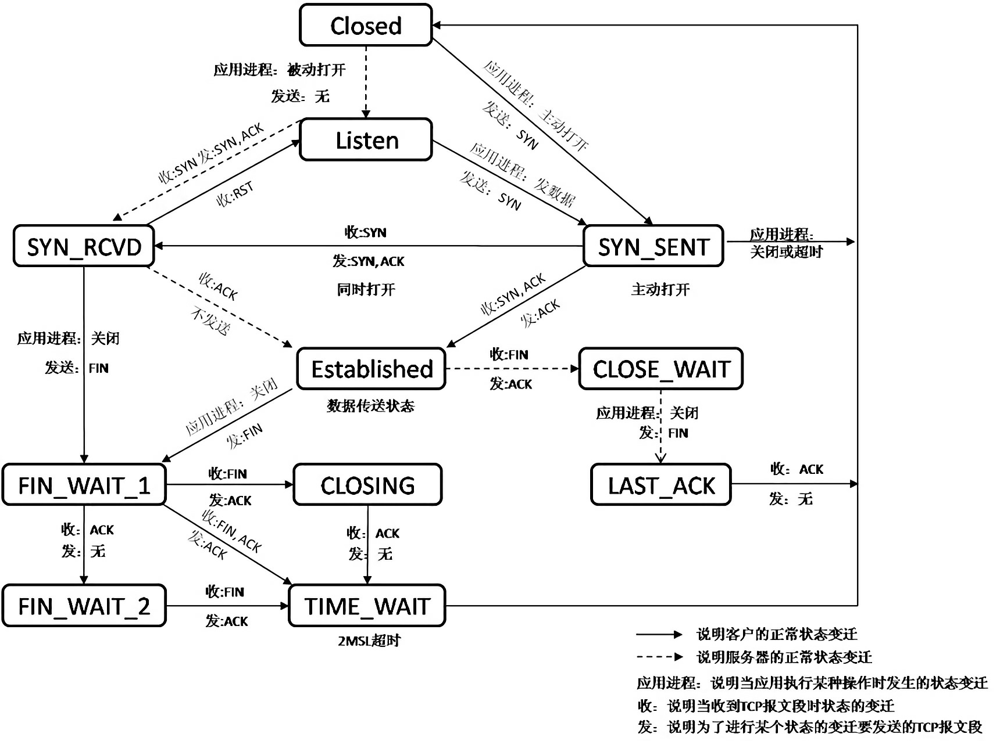

# TCP

---

## TCP为什么要三次握手

1. 为了实现可靠数据传输， TCP 协议的通信双方， 都必须维护一个序列号， 以标识发送出去的数据包，标明接收时序，防止接收到已经无效的连接请求报文
2. 三次握手的过程即是通信双方相互告知序列号起始值， 并确认对方已经收到了序列号起始值的必经步骤。如果只是两次握手， 至多只有连接发起方的起始序列号能被确认， 另一方选择的序列号则得不到确认

---

## TCP为什么要四次挥手

若只有三次，在接收方回复发送方的报文之后，此时接收方可能尚有数据未传输完毕，如此，则只能保证连接发起方的的数据传输完毕，不能保证接收方的数据传输完毕

---

## TCP和UDP的区别

TCP|UDP
:-|:-
TCP是面向连接的协议，发送数据之前需要建立连接|UDP是无连接的，即发送数据之前不需要建立连接
TCP提供传输的可靠性，无丢失，无差错，无重复，无乱序|UCP不提供可靠传输，只能保证尽力而为的送达
TCP适合准确性要求高，实时性要求不高的情况|UDP适合实时性要求高，可以忍受一定差错的情况
TCP是数据流模式|UDP是数据报模式
TCP有拥塞控制，网络拥塞时会导致网路变慢|UDP没有拥塞控制，网络拥塞时不会使网速变慢
TCP支持一对一传输|UDP支持一对一，一对多，多对一的传输
TCP connect会发起三次握手，且只能发起一次|UDP connect会断开之前连接的地址，然后连接新的地址，可以发起多次

---

## TCP协议如何保证传输可靠

方法|具体
:-|:-
校验和|通过校验码，校验接收的数据包，若数据包有误则不予回应
序列号|对传输的每份数据进行编号，防止报文缺失或失序
确认应答|对每份正确接收的报文予以确认回复，并表示下一份接收报文的序列号
超时重传|当超时未收到回应的报文，再次发送相同报文，直至得到回复
连接管理|三次握手和四次挥手，保证传输连接的准确性
流量控制|通过滑动窗口协议，通过ACK报文表示自己的窗口大小，制约发送方发送报文
拥塞控制|通过拥塞控制机制，当网络中出现拥塞时利用慢开始，拥塞避免以及快速恢复

---

## 滑动窗口协议的原理

将数据分成一段段报文，利用滑动窗口，将报文分成三种，（1）已发送已接收到回复，（2）已发送未收到回复，（3）未发送。窗口从第一个报文开始，当每发送一个报文且收到回复，则将滑动窗口，向前移动一格。当窗口已经内的所有报文已发送但未收到回复则等待，超时则重发

---

## 拥塞控制的方式

1. 慢开始
    最开始的传输回合内发送一份报文段，若成功抵达，则每个传输回合倍增拥塞窗口给的大小，直至到达门限值
2. 拥塞避免
    到达门限值时，不再将拥塞窗口倍增，而是每次加一，缓慢增加
3. 快重传
    在达到超时重传之前，如果连续三次收到冗余ACK则立即重发该报文段
4. 快恢复
    发送方收到三个重复的确认则将满开始门限置为原来的一半，并将拥塞窗口置为该值，然后进入拥塞避免阶段

---

## TCP三次握手全过程

1. 客户端发送一个SYN报文段，自生成报文段序号为X。客户端进入SYN_SEND状态
2. 服务端发送SYN + ACK报文段，自生成报文段序号为Y，确认号为客户端报文段序号X + 1。服务端进入SYN_RCVD状态
3. 客户端发送ACK报文段，报文段序号为Y + 1，确认号为Y + 1。客户端则进入ESTABLISHED状态，回复服务端，服务端进入ESTABLISHED状态

---

## TCP四次挥手全过程

1. 客户端发送FIN报文段，序列号为X，确认号为Y。客户端进入FIN_WAIT_1状态
2. 服务端发送ACK报文段，序列号为Y，确认号为客户端序列号X + 1。服务端进入CLOSE_WAIT状态。
3. 服务端剩余数据已处理完毕好则发送ACK + FIN报文段，序列号与确认号与之前一致。客户端进入FIN_WAIT_2状态，服务端进入LAST_ACK状态
4. 客户端发送ACK报文段，序列号为X + 1，确认号为Y + 1。客户端进入TIME_WAIT状态，2MSL后进入CLOSED状态，服务端进入CLOSED状态

---

## 为什么TIME-WAIT状态需要经过2MSL

因为在第四个报文发送完成后，接收方有可能没有收到最后的报文，于是会重新发起FIN + ACK报文，此时发起方就可以再此发送报文，直至，接收方收到报文，顺利关闭。而一个发送和接收周期最大时间为2MSL

---

## TIME_WAIT状态带来的问题

主动断开方处于TIME_WAIT状态时，源端口无法使用，因此如果频繁主动断开TCP连接，将很快耗尽端口号。一旦达到了上限，则新的请求就无法被处理，接着就是大量Too Many Open Files异常。解决TIME_WAIT大量出现，最核心的思想，就是打开系统的TIME_WAIT重用和快速回收，编辑/etc/sysctl.conf

---

## CLOSE_WAIT状态带来的问题

出现大量CLOSE_WAIT的现象，主要原因是某种情况下对方关闭了socket链接，但是我方忙与读或者写，没有关闭连接。代码需要判断socket，一旦读到0，断开连接，read返回负，检查一下errno，如果不是EAGIN，就断开连接

---

## TCP粘包

TCP连接为了有效利用网络资源会采用Nagle算法，将多个间隔较小，数据量较小的数据合并为一个大的数据包，然后进行封包发送。若这些小的数据包不是来自于同一份数据，则会出现粘包问题

1. 可禁用Nagle算法，使用TCP_NODELAY选项
2. 可在应用端对发送和接收的数据做严格的格式规定，例如限定起始字符，结束字符和数据长度等

---

## TCP异常终止

在TCP交互过程中，会出现一方服务异常，导致无法接受或者发送数据，在没有正常断开连接的情况下服务停止。此时需要系统向对方发送reset报文，使其释放连接资源

1. 客户端试图连接服务端未开放的端口，服务器向客户端发送reset
2. 在交互双方之中有任意一方异常退出，该方向对方发送reset
3. 接收端收到TCP报文，但其不在已建立的TCP连接列表之中，则其向对方发送reset报文
4. 在交互双方之后有任意一方长时间未收到对方的的确认报文，则其在超出一定的重传次数或是时间之后，会向对方主动发送reset，释放连接资源

## TCP状态图

---
