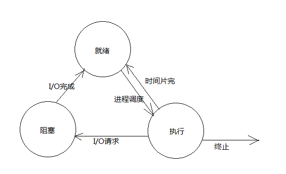
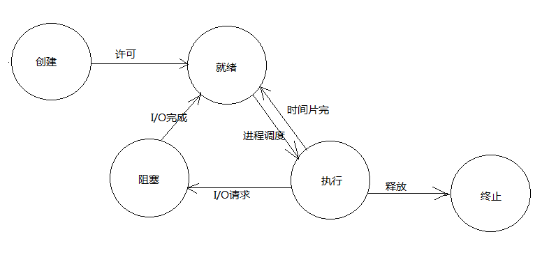

# 进程

---

## 孤儿进程和僵尸进程

- 孤儿进程：一个父进程退出，而它的一个或多个子进程还在运行，那么那些子进程将成为孤儿进程。孤儿进程将被init进程所收养，并由init进程对它们完成状态收集工作
- 僵尸进程：一个进程使用fork创建子进程，如果子进程退出，而父进程并没有调用wait或waitpid获取子进程的状态信息，那么子进程的进程描述符仍然保存在系统中

---

## 守护进程

守护进程是运行在后台的一种特殊进程。它独立于控制终端并且周期性地执行某种任务或等待处理某些发生的事件，自成进程组，自成会话，和终端无关。系统引导时装载启动，系统注销时关闭

---

## 创建进程

调用fork()或者vfork()，返回0则表示是子进程，返回大于0则表示父进程

### fork() vfork()

fork()之后父子进程执行顺序不定，vfork保证子进程先行，在子进程之后exec()或exit()之后父进程恢复运行。fork()子进程复制父进程地址空间，vfork()与子进程共享地址空间

### 父子进程分离

在调用fork()之前调用pthread_atfork(prepare(), parent(), child())，执行fork()之前先执行prepare()，执行fork()之后，父进程执行parent()，子进程执行child()

### fork()创建守护进程

1. umask(0)屏蔽文件掩码，给予最大权限
2. fork()创建子进程，父进程调用exit()
3. 子进程调用setsid()创建新的会话，使子进程成为新的会话的领头进程，并与其父进程会话组和进程组脱离
4. 子进程调用chdir("/")将新建会话的工作目录改为根目录，以防止当前目录有一个目录被删除，导致守护进程无效
5. 子进程调用close(0);close(1);close(2);关闭不再需要的文件描述符
6. 子进程调用signal(SIGCHLD, SIG_IGN)忽略SIGCHLD信号，将子进程交由init进程处理

### fork()拷贝内容

- 子进程与父进程共享数据空间、堆和栈，若父子进程任意一个修改则子进程拷贝这些为副本（Copy-On-Write）
- 子进程和父进程共享文件描述符和文件状态表
- 子进程继承父进程用户ID、组ID和会话ID等
- 子进程继承父进程控制终端、工作目录、根目录
- 子进程继承父进程文件模式屏蔽字、信号屏蔽字、共享储存段和资源限制

---

## 进程状态

### 进程状态详情

- R：可执行状态
    只有在该状态的进程才可能在CPU上运行，而同一时刻可能有多个进程处于可执行状态
- S：可中断的睡眠状态
    处于这个状态的进程因为等待socket连接或信号量等而被挂起
- D：不可中断睡眠状态
    进程处于睡眠状态，但是此刻进程是不可中断的，不可中断是指进程不响应异步信号
- T：暂停状态或跟踪状态
    向进程发送一个SIGSTOP信号，它就会因响应该信号而进入TASK_STOPPED状态
- Z：退出状态，进程成为僵尸进程
    在这个退出过程中，进程占有的大部分资源会被回收，剩余小部分无法回收
- X：退出状态，进程即将被销毁
    这意味着接下来的代码立即就会将该进程彻底释放，持续时间非常短

### 进程的常见状态和以及各种状态之间的转换条件

#### 三态

- 就绪：进程已处于准备好运行的状态，即进程已分配到除CPU外的所有必要资源后，只要再获得CPU，便可立即执行
- 执行：进程已经获得CPU，程序正在执行状态
- 阻塞：正在执行的进程由于发生某事件（如I/O请求、申请缓冲区失败等）暂时无法继续执行的状态

#### 五态

- 创建：为进程分配资源转入就绪队列
- 就绪：进程已处于准备好运行的状态，即进程已分配到除CPU外的所有必要资源后，只要再获得CPU，便可立即执行
- 执行：进程已经获得CPU，程序正在执行状态
- 阻塞：正在执行的进程由于发生某事件（如I/O请求、申请缓冲区失败等）暂时无法继续执行的状态
- 终止：进程正在从系统中结束，释放占有资源

---

## 进程同步机制

进程同步的主要任务：是对多个相关进程在执行次序上进行协调，以使并发执行的诸进程之间能有效地共享资源和相互合作，从而使程序的执行具有可再现性。
同步机制遵循的原则：

1. 空闲让进
2. 忙则等待（保证对临界区的互斥访问）
3. 有限等待（有限代表有限的时间，避免死等）
4. 让权等待，（当进程不能进入自己的临界区时，应该释放处理机，以免陷入忙等状态）

---

## 进程调度

### 调度定义

进程调度是操作系统进程管理的一个重要组成部分，其任务是选择下一个要运行的进程

### 进程调度策略

- FCFS(先来先服务，队列实现，非抢占的)：先请求CPU的进程先分配到CPU
- SJF(最短作业优先调度算法)：平均等待时间最短，但难以知道下一个CPU区间长度
- 优先级调度算法(可以是抢占的，也可以是非抢占的)：优先级越高越先分配到CPU，相同优先级先到先服务，存在的主要问题是：低优先级进程无穷等待CPU，会导致无穷阻塞或饥饿
- 时间片轮转调度算法(可抢占的)：队列中没有进程被分配超过一个时间片的CPU时间，除非它是唯一可运行的进程。如果进程的CPU区间超过了一个时间片，那么该进程就被抢占并放回就绪队列
- 多级队列调度算法：将就绪队列分成多个独立的队列，每个队列都有自己的调度算法，队列之间采用固定优先级抢占调度。其中，一个进程根据自身属性被永久地分配到一个队列中
- 多级反馈队列调度算法：与多级队列调度算法相比，其允许进程在队列之间移动：若进程使用过多CPU时间，那么它会被转移到更低的优先级队列；在较低优先级队列等待时间过长的进程会被转移到更高优先级队列，以防止饥饿发生

### 上下文切换

用户空间的应用程序，通过系统调用，进入内核空间。这个时候用户空间的进程要传递 很多变量、参数的值给内核，内核态运行的时候也要保存用户进程的一些寄存 器值、变量等。所谓的进程上下文，可以看作是用户进程传递给内核的这些参数以及内核要保存的那一整套的变量和寄存器值和当时的环境等

### 上下文中断

硬件通过触发信号，导致内核调用中断处理程序，进入内核空间。这个过程中，硬件的 一些变量和参数也要传递给内核，内核通过这些参数进行中断处理。所谓的中断上下文，其实也可以看作就是硬件传递过来的这些参数和内核需要保存的一些其他环境（主要是当前被打断执行的进程环境）

---

## 进程通信

- 匿名管道：无名字，内容保存在内核中，只有具有亲缘进程之间可以进行通信，父写子读是，父进程关闭读端，子进程关闭写端，效率较低
- 命名管道：有自己的名字，但是有名管道名称保存在磁盘上，但是内容保存在内核中，互不相关的进程可以进行通信，一端以读打开，一端以写打开，效率较低
- 信号：信号是进程间通信机制中唯一的异步通信机制，因为可以在任何时候发送信号给某一进程，当需要消息通知时使用
- 消息队列：消息队列提供了一个从一个进程向另外一个进程发送一块数据的方法，非实时消息，需要数据在内核态和用户态之间拷贝，消息队列有长度限制（MSGMNB 16K），每块数据也有大小限制（MSGMAX 8K）
- 共享内存：共享内存就是允许两个或多个进程共享一定的存储区，数据无需复制，只能共享数据不能提供同步
- 信号量：信号量本质上是一个计数器，用于多进程对共享数据对象的读取，不用来传输数据，用来保护共享资源，使得资源在一个时刻只有一个进程独享
- socket：在跨网络与不同主机上的进程之间通信，TCP需要建立连接，UDP不需要建立连接

---
