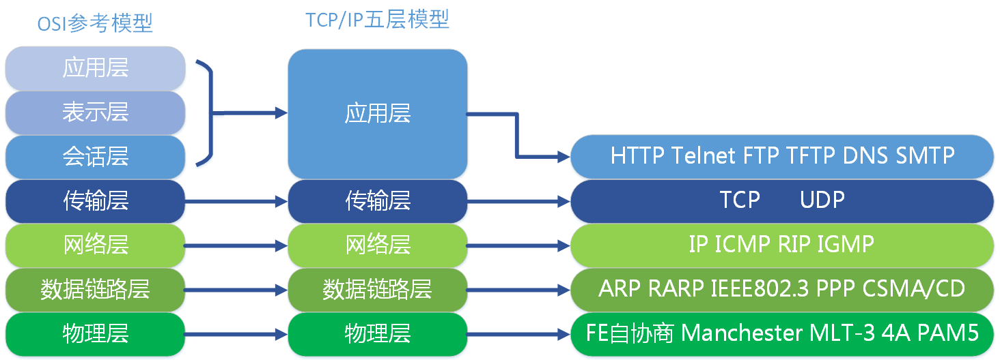

# 分层体系结构

1. 英特网分层协议及作用是什么

    层级|功能|分组
    -|-|-
    应用层|网络应用程序及它们的应用层协议存留的地方|报文
    运输层|在应用程序断点之间传送应用层报文|报文段
    网络层|将数据报从一台主机移动到另一台主机|数据报
    链路层|将帧从一个网络元素移动到临近的网络元素|帧
    物理层|将帧中的比特从一个节点移动到下一个节点|比特

2. OSI参考模型分层是什么

- 应用层
- 表示层
- 会话层
- 运输层
- 网络层
- 链路层
- 物理层
