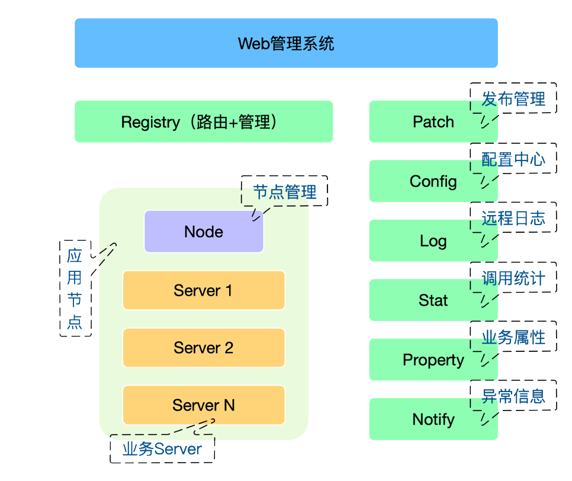
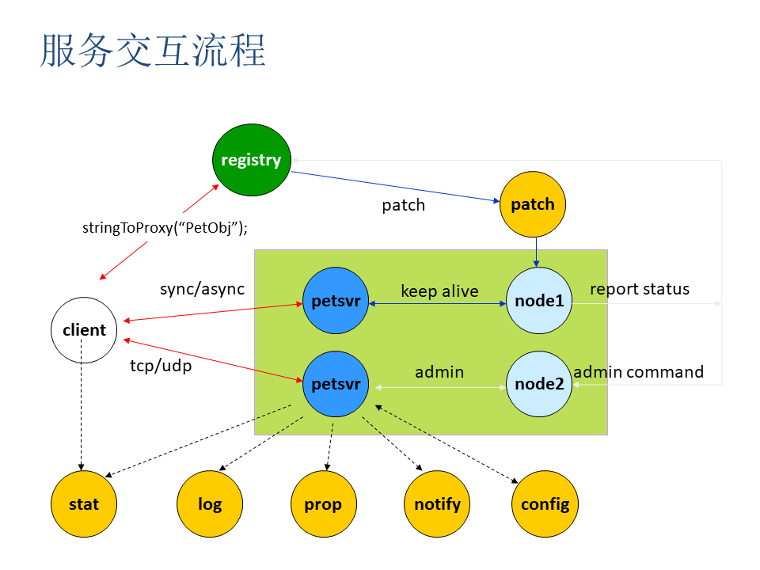
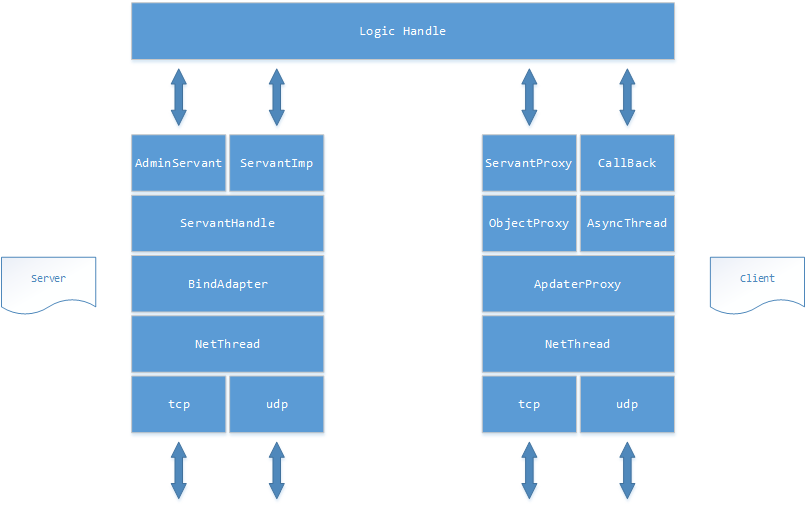
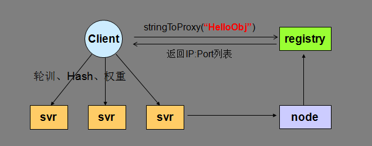

# 框架简介

## 框架基本节点

### Web-管理系统

`Web`服务管理平台用于服务的管理与运维

### Registry-主控节点

`Registry`服务提供对象名称寻址服务，返回`IP:Port`列表，为客户端提供可用服务列表信息。同时，它提供TARS框架核心管理功能 ：服务部署、服务起停、服务状态信息查询、发布、配置管理、命令通知

### Patch-发布管理

`Patch`服务提供服务的发布功能，用于实现服务发布包的上传、管理与发布，配合`Web`平台，能够管理所有需要发布的服务和文件的目录

### Config-配置中心

`Config`服务用于提供整套框架的配置文件保存和读取等操作，后台使用`mysql`存储。配置拉取服务化，服务只需调用配置服务的接口即可获取到配置文件

### Log-日志中心

`tars`框架的日志服务，用于接收远程日志

### Stat-调用统计

`Stat`服务用于监控服务进程的运行质量，提供服务模块间调用信息统计上报的功能

### Property-业务属性

`Property`服务提供用户自定义属性上报功能，用于监控业务的运行质量情况和相关指标的统计

### Notify-异常信息

`Notify`用于获取服务的业务异常上报的`report`

### Node-节点管理

`Node`服务节点可以认为是服务所实际运行的一个具体的操作系统实例，可以是物理主机或者虚拟主机、云主机。每台服务节点上均有一个Node服务和多个业务服务，Node服务会对业务服务进行统一管理

## 服务交互流程

框架服务在整个系统中运行时，服务之间的交互分：业务服务之间的交互、业务服务与框架基础服务之间的交互

### 服务发布流程

在`Web`上传`Server`的发布包到`Patch`，上传成功后，在`Web`上提交发布server请求，由`Registry`服务传达到`Node`，然后`Node`拉取`Server`的发布包到本地，拉起`Server`服务

### 管理命令流程

`Web`上的可以提交管理`Server`服务命令请求，由`Registry`服务传达到`Node`服务，然后由`Node`向`Server`发送管理命令

### 心跳上报流程

`Server`服务运行后，会定期上报心跳到`Node`，`Node`然后把服务心跳信息上报到`Registry`服务，由`Registry`进行统一管理

### 信息上报流程

`Server`服务运行后，会定期上报统计信息到`Stat`，打印远程日志到`Log`，定期上报属性信息到`Property`、上报异常信息到`Notify`、从`Config`拉取服务配置信息

### Client访问Server流程

`client`可以通过`Server`的对象名`Obj`间接访问`Server`，`Client`会从`Registry`上拉取`Server`的路由信息，然后根据具体的业务特性访问`Server`

## 服务结构图

### 服务端

- NetThread：网络线程，负责收发包，连接管理，多线程，采用`epoll` `ET`触发实现，支持`tcp/udp`
- BindAdapter： 绑定端口类，用于管理`Servent`对应的绑定端口的信息操作
- ServantHandle：业务线程类，根据对象名分派`Servant`的对象和接口调用
- AdminServant：管理端口的对象
- ServantImp： 继承`Servant`的业务处理基类

### 客户端

- NetThread：网络线程， 收发包，连接管理，多线程，采用`epoll` `ET`触发实现，支持`tcp/udp`
- AdapterProxy：具体服务器某个节点的本地代理，管理到服务器的连接，以及请求超时处理
- ObjectProxy：远程对象代理，负责路由分发、负载均衡、容错，支持轮询/哈希/权重
- ServantProxy：远程对象调用的本地代理，支持同步/异步/单向，Tars协议和非Tars协议
- AsyncThread：异步请求的回应包处理线程
- Callback：具体业务`Callback`的处理基类对象

## 调用方式

- 同步调用：客户端发出调用请求后等待服务返回结果后再继续逻辑
- 异步调用：客户端发出调用请求后继续其他业务逻辑，服务端返回结果又由回调处理类处理结果
- 单向调用：客户端发出调用请求后就结束调用，服务端不返回调用结果

## 负载均衡

框架通过名字服务来实现服务的注册与发现，`Client`通过访问名字服务获取到被调服务的地址信息列表，`Client`再根据需要选择合适的负载均衡方式来调用服务，负载均衡支持轮询、哈希、权重等多种方式

## 容错保护

### 名字服务排除

业务服务主动上报心跳给名字服务，使名字服务知道服务部署的节点存活情况，当服务的某节点故障时，名字服务不在返回故障节点的地址给`Client`，达到排除故障节点的目标。名字服务排除故障需要通过服务心跳和Client地址列表拉取两个过程，故障排除时间在1分钟左右

### Client主动屏蔽

为了更及时的屏蔽故障节点，`Client`根据调用被调服务的异常情况来判断是否有故障来更快进行故障屏蔽。具体策略是，当`Client`调用某个`Svr`出现调用连续超时，或者调用的超时比率超过一定百分比，`Client`会对此`Svr`进行屏蔽，让流量分发到正常的节点上去。对屏蔽的`Svr`节点，每隔一定时间进行重连，如果正常，则进行正常的流量分发

## 过载保护

为了防止业务因为访问量突增或服务器故障造成系统整体的繁忙，进而导致全部服务的不可用，框架内部做相应设计来应对。实现请求队列，服务调用通过非阻塞方式实现异步系统，从而达到提升系统处理能力的目的。并且对队列的长度进行监控，当超过某个阀值，则拒绝新的请求。对请求设置超时时间，当请求包从队列里读取出来是判断请求是否超时，如果超时则不做处理

## tars协议

tars编码协议是一种数据编解码规则，它将整形、枚举值、字符串、序列、字典、自定义结构体等数据类型按照一定的规则编码到二进制数据流中。对端接收到二进制数据流之后，按照相应的规则反序列化可得到原始数值

### 数据交互过程

1. 客户端原始请求数据 -> 序列化 -> 服务端
2. 服务端 -> 反序列化 -> 原始请求数据
3. 服务端原始返回数据 -> 序列化 -> 客户端
4. 客户端 -> 反序列化 -> 原始返回数据
