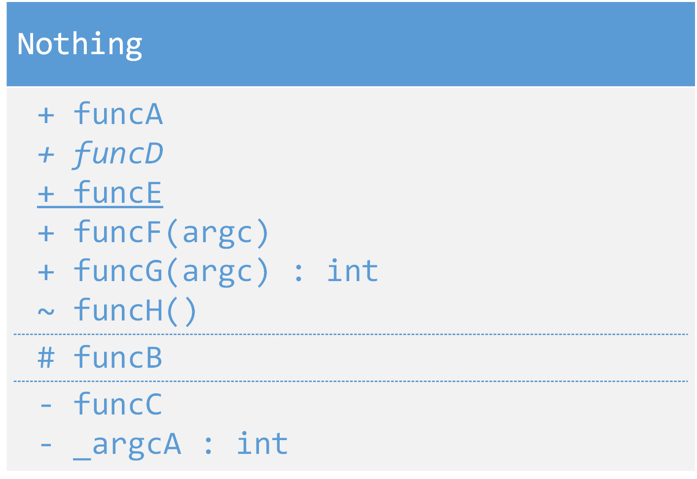

# 基础



``` cpp

class Nothing
{
public:
    void funcA();

    virtual void funcD();

    static void funcE()

    void funcF(int argc);

    int funcG(int argc);

    // 包内public，未知如何实现

protected:
    void funcB();

private:
    void funcC();
};

```
